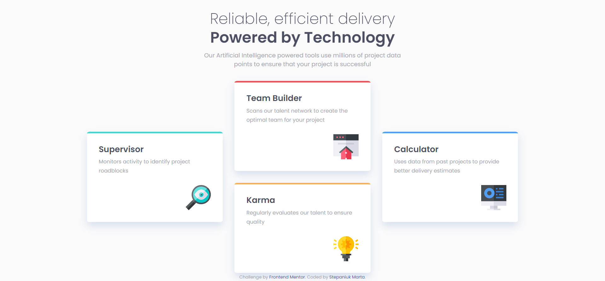

# Frontend Mentor - Four card feature section solution

This is a solution to the [Four card feature section challenge on Frontend Mentor](https://www.frontendmentor.io/challenges/four-card-feature-section-weK1eFYK). Frontend Mentor challenges help you improve your coding skills by building realistic projects. 

## Table of contents

- [Overview](#overview)
  - [The challenge](#the-challenge)
  - [Screenshot](#screenshot)
  - [Links](#links)
- [My process](#my-process)
  - [Built with](#built-with)
  - [What I learned](#what-i-learned)
  - [Continued development](#continued-development)
  - [Useful resources](#useful-resources)
- [Author](#author)

## Overview

### The challenge

Users should be able to:

- View the optimal layout for the site depending on their device's screen size

### Screenshot

### Links

- Solution URL: [Add solution URL here](https://your-solution-url.com)
- Live Site URL: [[Add live site URL here](https://martastepaniuk.github.io/four-card-feature-section-master/)]([https://your-live-site-url.com](https://martastepaniuk.github.io/four-card-feature-section-master/))

## My process

### Built with

- Semantic HTML5 markup
- CSS custom properties
- Flexbox
- Responsive design

### What I learned

During this challenge I learned an approach called BEM and started using REM for accessibility.

### Continued development

In future projects I would like to focus on using an approach called BEM, learn SASS and CSS Grid.

### Useful resources

- [CSS REM – What is REM in CSS?](https://www.freecodecamp.org/news/what-is-rem-in-css/#:~:text=Using%20REM%20or%20another%20relative,due%20to%20a%20visual%20impairment.) - This helped me learn about REM.
- [Block Element Modifier](https://sparkbox.com/foundry/bem_by_example) - This helped me to consider an approach called BEM. I would recommend it to anyone who is still learning this.

## Author

- Frontend Mentor - [@MartaStepaniuk](https://www.frontendmentor.io/profile/MartaStepaniuk)
- GitHub - [@MartaStepaniuk](https://github.com/MartaStepaniuk)
- Twitter - [@Marta_Stepaniuk](https://twitter.com/Marta_Stepaniuk)
